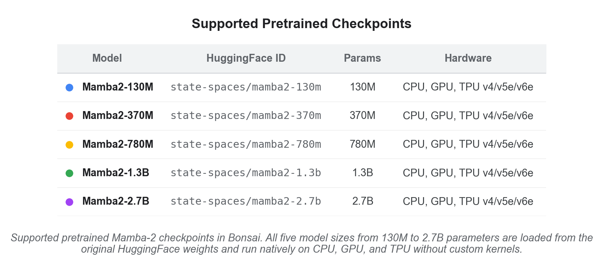
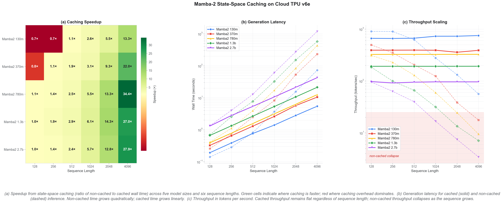

# Mamba2-JAX

[](https://pypi.org/project/mamba2-jax/)
[](LICENSE)

A pure JAX/Flax NNX implementation of the Mamba2 state-space model with SSM state caching, pretrained weight loading from HuggingFace, causal language modeling, and time-series forecasting.

This is the standalone PyPI package for the Mamba2 implementation authored by [Cosmo Santoni](https://github.com/CosmoNaught) and merged into Google's [JAX ML Bonsai](https://github.com/jax-ml/bonsai) library. The upstream source lives at [`bonsai/models/mamba2`](https://github.com/jax-ml/bonsai/tree/main/bonsai/models/mamba2).

## Supported Models

[](docs/model_support_table.png)

## Features

- **Flax NNX** modules (no legacy `init`/`apply` ceremony)
- **SSM + convolution state caching** for O(n) autoregressive generation
- **Pretrained weight loading** from HuggingFace (`state-spaces/mamba2-130m`, etc.)
- **Causal language modeling** (`Mamba2ForCausalLM`) with tied or untied embeddings
- **Time-series forecasting** (`Mamba2Forecaster`)
- **Golden parity tests** against the reference `mamba_ssm` PyTorch implementation
- Fully compatible with `jax.jit`, `jax.grad`, `jax.vmap`
- Runs on **CPU, GPU (CUDA), and TPU**

## State Space Caching

The SSM state cache enables O(n) autoregressive generation instead of O(n^2) re-computation. The example below demonstrates a **~30x speedup** on the 780M parameter model running on a TPU v6e when caching is enabled:


## Installation

### From PyPI

```bash
pip install mamba2-jax
```

### From source

```bash
git clone https://github.com/CosmoNaught/mamba2-jax.git
cd mamba2-jax
pip install -e ".[dev]"
```

### For loading pretrained weights

```bash
pip install "mamba2-jax[pretrained]"
```

For GPU or TPU support, install the appropriate JAX backend as described in the [JAX installation guide](https://jax.readthedocs.io/en/latest/installation.html).

## Usage

### Causal Language Model

```python
import jax.numpy as jnp
from flax import nnx
from mamba2_jax import Mamba2Config, Mamba2ForCausalLM

cfg = Mamba2Config(vocab_size=1024, hidden_size=256, num_hidden_layers=4,
                   state_size=64, head_dim=32, chunk_size=64)
model = Mamba2ForCausalLM(cfg, rngs=nnx.Rngs(0))

input_ids = jnp.ones((2, 64), dtype=jnp.int32)
outputs = model(input_ids, labels=input_ids)

print(outputs["logits"].shape)  # (2, 64, 1024)
print(float(outputs["loss"]))
```

### Loading pretrained weights

```python
from mamba2_jax import Mamba2ForCausalLM

model = Mamba2ForCausalLM.from_pretrained("state-spaces/mamba2-130m")
```

### Cached generation

```python
import jax.numpy as jnp
from mamba2_jax import Mamba2ForCausalLM, Mamba2Config

cfg = Mamba2Config.tiny()
model = Mamba2ForCausalLM(cfg, rngs=__import__("flax").nnx.Rngs(0))

# Prefill
prompt = jnp.array([[1, 2, 3]], dtype=jnp.int32)
out = model(prompt)
cache = out["cache"]

# Decode with cache (O(1) per step)
next_token = jnp.array([[4]], dtype=jnp.int32)
out = model(next_token, cache=cache)
print(out["logits"].shape)  # (1, 1, vocab_size)
```

### Time-series forecasting

```python
import jax.numpy as jnp
from mamba2_jax import Mamba2Forecaster, create_random_forecaster

model = create_random_forecaster(input_dim=10, d_model=256, n_layers=4,
                                  output_dim=1, forecast_horizon=24)

x = jnp.ones((8, 100, 10))  # (batch, seq_len, features)
y = model(x)
print(y.shape)  # (8, 24, 1)
```

## Performance

Benchmarked on a TPU v6e with the `state-spaces/mamba2-130m` checkpoint:

[](docs/alt_combined_figure.png)

## Project Structure

```
mamba2-jax/
├── mamba2_jax/
│   ├── __init__.py          # Public API
│   ├── modeling.py          # Config, SSD kernel, all model classes
│   └── params.py            # Weight loading & parameter utilities
├── tests/
│   ├── test_mamba2.py       # Comprehensive test suite
│   ├── run_model.py         # Generation demo script
│   └── artifacts/           # Golden parity data
├── docs/                    # Benchmark figures
├── LICENSE                  # Apache 2.0
├── pyproject.toml
└── README.md
```

## Contributing

Contributions are welcome! Areas where help is particularly valuable:

- Performance optimization and profiling
- Test coverage expansion
- Bug reports and feature requests

Please open an issue or submit a pull request on GitHub.

## Acknowledgments

**Original Mamba2 Authors:**
- Tri Dao and Albert Gu for the Mamba2 architecture and the original `mamba_ssm` implementation
- The State Spaces team for advancing SSM research

**JAX Ecosystem:**
- The JAX, Flax, and Optax teams at Google for the excellent frameworks

## License

This project is licensed under the [Apache License 2.0](LICENSE).

## Citation

If you use this implementation in your research, please cite the original Mamba2 paper and this JAX implementation:

```bibtex
@inproceedings{mamba2,
  title={Transformers are {SSM}s: Generalized Models and Efficient Algorithms
         Through Structured State Space Duality},
  author={Dao, Tri and Gu, Albert},
  booktitle={International Conference on Machine Learning (ICML)},
  year={2024}
}

@software{mamba2jax,
  author  = {Cosmo Santoni},
  title   = {mamba2-jax: Pure JAX Implementation of Mamba2},
  year    = {2025},
  url     = {https://github.com/CosmoNaught/mamba2-jax}
}
```
